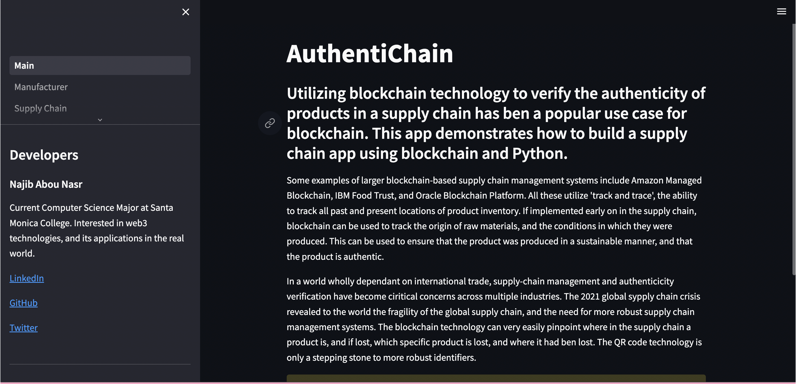
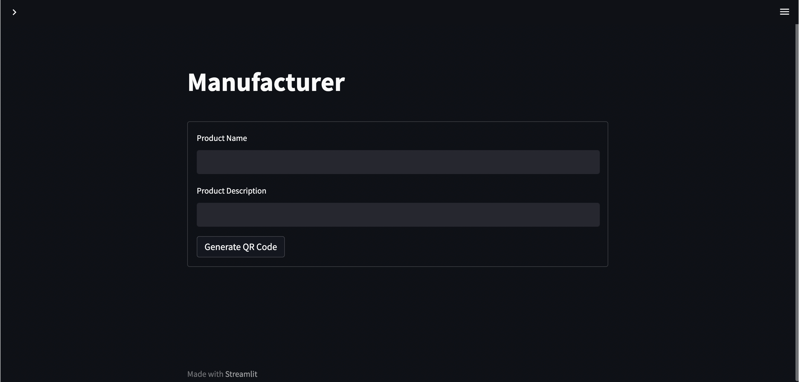
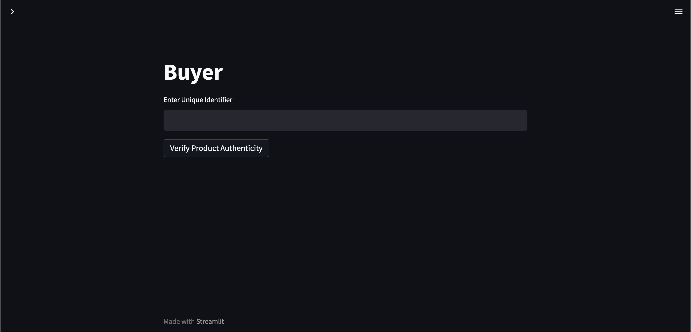
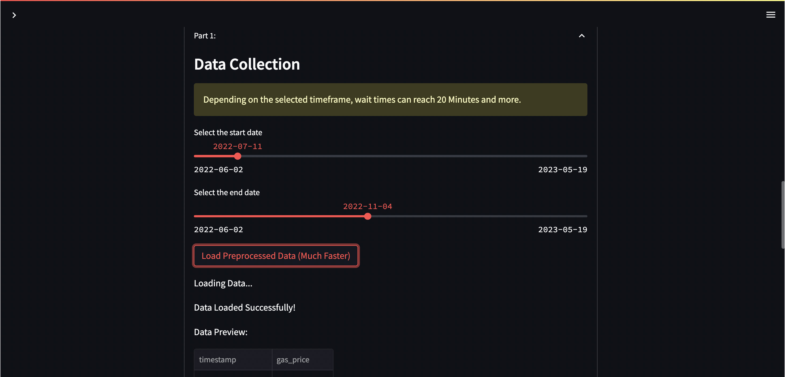
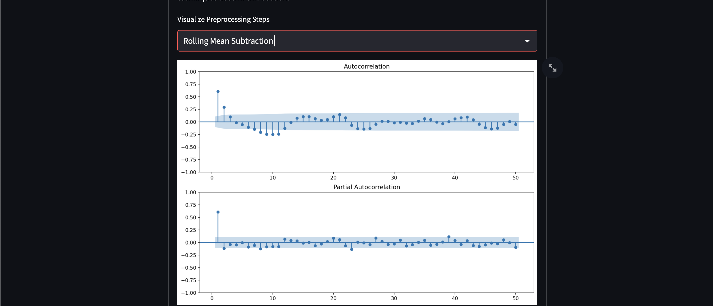
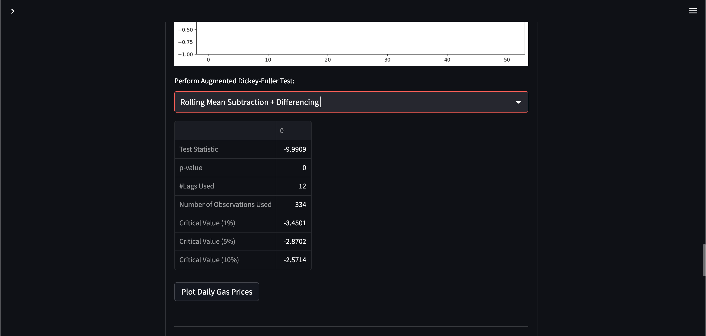
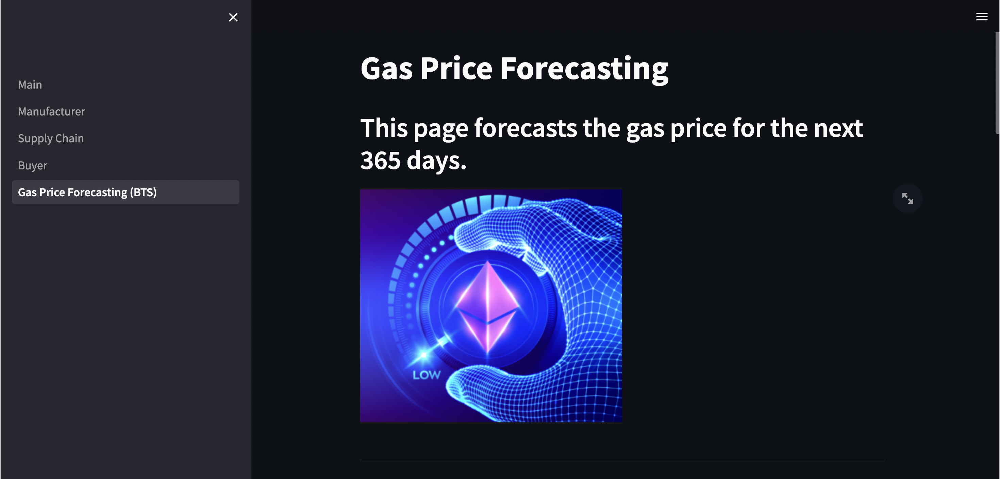
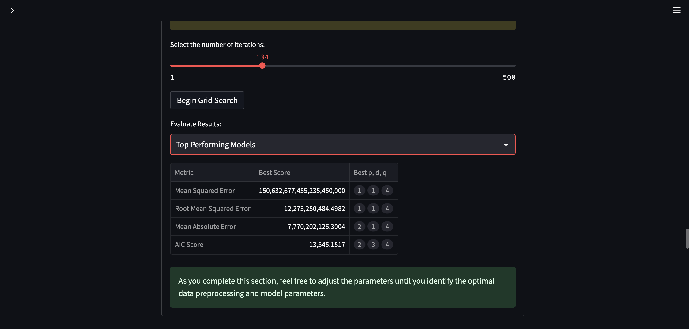
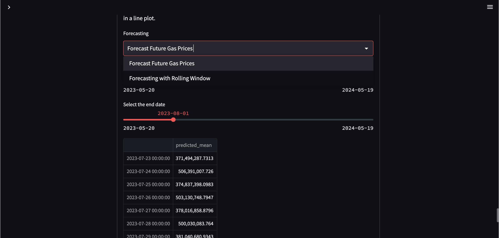
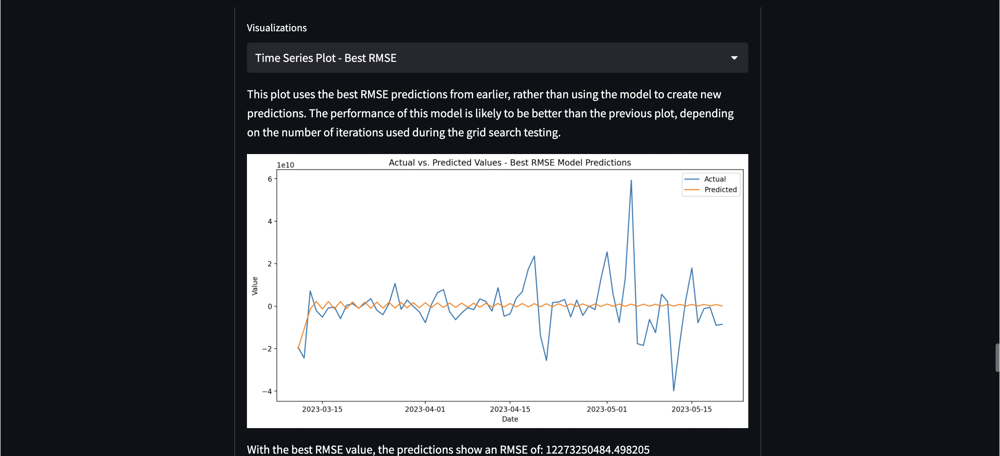

# AuthentiChain: Blockchain-based Supply Chain Verification System


AuthentiChain is a Python application that demonstrates how blockchain technology can be utilized
to verify the authenticity of products in a supply chain. The application was developed using Python, Streamlit, and Web3.

## Table of Contents
1. [Introduction](#introduction)
2. [Installation](#installation)
3. [Usage](#usage)
4. [Developers](#developers)
5. [License](#license)
## Introduction



Utilizing blockchain technology to verify the authenticity of products in a supply chain has been a popular use case for blockchain. This application demonstrates how to build such a system using blockchain and Python. 


The system could be used to track the origin of raw materials, and the conditions in which they were produced, ensuring that the product is produced in a sustainable manner and is authentic. It can also pinpoint where in the supply chain a product is, and if lost, which specific product is lost, and where it had been lost. The QR code technology used in the system is a stepping stone to more robust identifiers.

AuthentiChain is a demonstration of the capabilities of blockchain ledger technology and is not meant to be used in a production environment.

## Installation

1. Clone the repository:

```bash
git clone https://github.com/your-repo/authentichain
```

2. Install the dependencies:

```bash
pip install -r requirements.txt
```

3. Set up the environment variables:

Create a `.env` file in your project root and include your smart contract ABI and address:

```bash
CONTRACT_ABI=your_smart_contract_abi
CONTRACT_ADDRESS=your_smart_contract_address
```


## Pages

### Main Page


On the main page, we explain the purpose of the app, display a warning to users that the application is for demonstration purposes only, and provide information about the developers.

The code to start up the main page can be found here.

### Manufacturer Page



The manufacturer page allows a user to input product details (name and description) and generate unique QR code that represents the product. Once the "Generate QR Code" button is pressed, a QR code is generated and displayed.

### Supply Chain Page


The supply chain page is currently a placeholder and will be developed in future versions of the application.

### Buyer Page



The buyer page provides a user interface for buyers to verify the authenticity of a product. The buyer inputs the unique identifier of the product, and upon pressing the "Verify Product Authenticity" button, the system verifies whether the product is authentic and displays the appropriate message.

### Future Work

Future improvements to AuthentiChain may include expanded functionality on the supply chain page, improved QR code generation, and more advanced product verification techniques.


## Gas Price Forecasting:

### Background:

The ARIMA model is a statistical model that uses time series data to predict future values. It combines the autoregressive model (AR) and the moving average model (MA). The AR model considers the relationship between an observation and lagged observations, while the MA model uses the dependency between an observation and residual errors from a moving average model. The ARIMA model includes differencing to make the time series stationary.

Gas prices in Ethereum are denoted in Gwei, a denomination of Ether (ETH). Gas is the fee paid to miners to include a transaction in a block. The higher the gas price, the faster the transaction is processed.

The data source for gas price data is the Ethereum blockchain, obtained using the Alchemy API. Alchemy API is a blockchain developer platform that connects to the Ethereum blockchain and fetches gas price data.

This section of the application was developed by Najib Abou Nasr, who oversaw the data preprocessing, ML training, and UI design of the application.

### Gas Price Forecasting Page

The Gas Price Forecasting page allows users to select a start date and end date to load gas price data. They can choose between loading live data, which retrieves data from the Ethereum blockchain, or loading preprocessed data for faster loading times.

## Part 1: Data Collection

### Data Collection



The Data Collection section allows users to select the start and end dates for which they want to collect gas price data. If the "Load Live Data" button is clicked, the application connects to the Ethereum blockchain using the Alchemy API and fetches the gas price data for the specified timeframe. The fetched data is then saved to a CSV file.

### Preprocessed Data



Alternatively, users can click the "Load Preprocessed Data" button to load preprocessed gas price data from a CSV file. This option provides faster loading times compared to fetching live data. The loaded data is displayed as a preview.

## Part 2: Data Preprocessing

### Data Preprocessing



The Gas Price Forecasting page performs data preprocessing on the loaded gas price data. It calculates the rolling mean and generates differenced data to make the time series stationary. The differenced data is stored for later use in the forecasting process.

The data preprocessing step is used to transform the data into a format that is suitable for the ARIMA model. The data preprocessing includes the following steps:

1. **Load the Data**: Load the time series data that you want to analyze and forecast. Ensure that the data is in a suitable format, such as a pandas DataFrame or NumPy array.

2. **Check for Stationarity**: Stationarity is an important assumption for ARIMA models. Check if the time series data is stationary, meaning that its statistical properties (mean, variance, autocorrelation) remain constant over time. You can perform a visual inspection or use statistical tests like the Augmented Dickey-Fuller (ADF) test.

3. **Transform the Data**: If the data is not stationary, you need to transform it to achieve stationarity. Common techniques include differencing (computing the difference between consecutive observations) or taking the logarithm of the values. These transformations help stabilize the mean and variance of the time series.

4. **Plot Autocorrelation and Partial Autocorrelation**: Examine the autocorrelation and partial autocorrelation plots to determine the order of the autoregressive (AR) and moving average (MA) components of the ARIMA model. The autocorrelation plot shows the correlation between the time series and its lagged values, while the partial autocorrelation plot shows the correlation between the time series and its lagged values after removing the effects of intervening lags.

5. **Determine the Order (p, d, q)**: Based on the autocorrelation and partial autocorrelation plots, select the order of the ARIMA model. The order is represented as (p, d, q), where p is the order of the autoregressive component, d is the degree of differencing, and q is the order of the moving average component.

6. **Split the Data**: Split the time series data into training and testing sets. The training set is used to fit the ARIMA model, while the testing set is used to evaluate its performance.

7. **Fit the ARIMA Model**: Using the training data, fit the ARIMA model with the chosen order (p, d, q). This step involves estimating the model parameters.

8. **Validate the Model**: Validate the fitted ARIMA model using various techniques such as residual analysis, mean absolute error (MAE), root mean square error (RMSE), or other relevant evaluation metrics. Adjust the model or order if necessary.

9. **Forecasting**: Once the ARIMA model is validated, use it to forecast future values of the time series. Provide the necessary input (e.g., number of periods to forecast) and generate the forecasts.

You can choose from the following options to visualize the preprocessing steps:

- **Simple Differencing**: Perform differencing on the data by computing the difference between consecutive observations.

- **Rolling Mean Subtraction**: Subtract the rolling mean from the data to remove the trend.

- **Rolling Mean Subtraction + Differencing**: Perform rolling mean subtraction and then compute the difference between consecutive observations.

- **Original Data**: Use the original, unprocessed data.

After selecting a preprocessing option, you can plot the daily gas prices and apply the Augmented Dickey-Fuller Test (ADF) to check for stationarity. The ADF test helps determine if the data is stationary based on the null hypothesis that the time series is non-stationary. The ADF test results provide information about the stationarity of the data, including the test statistic, p-value, and critical values.


To visualize the preprocessing steps and perform the ADF test, click on the corresponded buttons provided.

Resources:

- [ADF Test in Python (StatsModels)](https://www.statsmodels.org/stable/generated/statsmodels.tsa.stattools.adfuller.html)
- [ACF and PACF in Python (StatsModels)](https://www.statsmodels.org/stable/generated/statsmodels.graphics.tsaplots.plot_acf.html)
- [ARIMA Model in Python (StatsModels)](https://www.statsmodels.org/stable/generated/statsmodels.tsa.arima.model.ARIMA.html)
- [Stationarity Test in Python (ADF)](https://www.statsmodels.org/stable/generated/statsmodels.tsa.stattools.adfuller.html)
- [Seasonal Decomposition of Time Series in Python](https://machinelearningmastery.com/decompose-time-series-data-trend-seasonality/)
- [MAE in Python (Scikit-Learn)](https://scikit-learn.org/stable/modules/generated/sklearn.metrics.mean_absolute_error.html)
- [RMSE in Python (Scikit-Learn)](https://scikit-learn.org/stable/modules/generated/sklearn.metrics.mean_squared_error.html)
- [Time Series Forecasting with ARIMA in Python](https://www.machinelearningplus.com/time-series/arima-model-time-series-forecasting-python/)

## Part 3: Arima Modeling:



In this section, the focus is on training and evaluating ARIMA models. It involves the following steps:

- Train/Test Split: Splits the time series data into training and testing sets, where the training set is used for model fitting and the testing set is used for evaluation.

- Grid Search: Performs an exhaustive search over different combinations of ARIMA parameters (p, d, q) to find the optimal model. The search is based on minimizing the AIC score, a measure of model quality.



- Evaluation Metrics: Evaluates the performance of ARIMA models using metrics such as mean squared error, root mean squared error, mean absolute error, and AIC score.

- Model Selection: Identifies the best-performing ARIMA model based on the chosen evaluation metric.

## Part 4: Forecasting

Once the optimal ARIMA model is selected, this section allows you to make future predictions using the model. It provides forecasts for the next 7 days based on the chosen model and displays the predicted values.



The application provides an interactive interface where you can adjust the data preprocessing techniques, explore different ARIMA model parameters, and observe the corresponding forecasts. This allows you to iteratively refine the modeling process and improve the accuracy of the predictions.



Overall, this application simplifies the process of time series analysis and forecasting using the ARIMA model, making it accessible to users without extensive knowledge of the underlying concepts and programming.

## Usage

Run the application using Streamlit:

```bash
streamlit run app.py
```

## Developers

- **Najib Abou Nasr**
  - LinkedIn: [Link](https://www.linkedin.com/in/najib-abou-nasr-a43520258/)
  - GitHub: [Link](https://github.com/najibabounasr)
  - Twitter: [Link](https://twitter.com/najib_abounasr)
  
- **Alex Lichcaeva**
  - LinkedIn: [Link](https://www.linkedin.com/developer2)
  - GitHub: [Link](https://github.com/developer2)
  - Twitter: [Link](https://twitter.com/developer2)
  
- **Alphonso Logan**
  - LinkedIn: [Link](https://www.linkedin.com/developer3)
  - GitHub: [Link](https://github.com/developer3)
  - Twitter: [Link](https://twitter.com/developer3)
  
## License

This project is licensed under the MIT License - see the [LICENSE.md](LICENSE.md) file for details.
